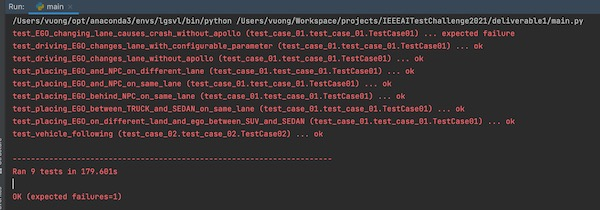

# Test Case 01 - Lane Change

In this section, we implement several test cases that move a vehicle from one lane to another where both routes have the same direction of travel. There are eights test cases, and you can find their implementation in the following [script](https://github.com/TrackerSB/IEEEAITestChallenge2021/blob/master/deliverable1/test_case_01/test_case_01.py).

## Run the test case
Make sure you installed the required libraries in the [requirements.txt](https://github.com/TrackerSB/IEEEAITestChallenge2021/blob/master/deliverable1/requirements.txt) and then simply run: 

```bash
python [Github Source Code]/deliverable1/main.py
```

 Here is expected results:



