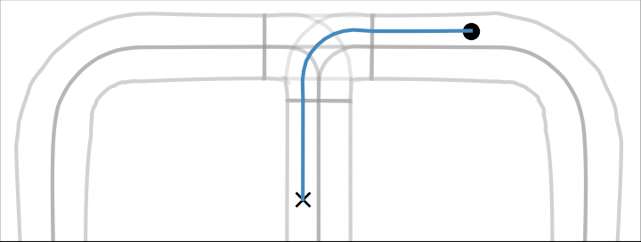
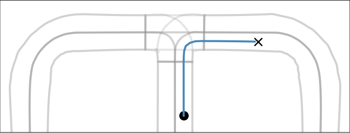
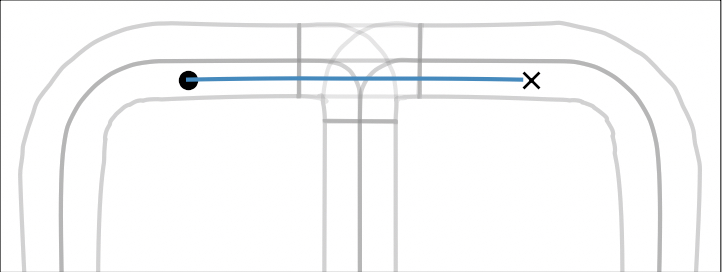

# Deliverable #2

## Introduction

This document is our written simulation test report. Unfortunately, we were not able to submit a paper to the IEEE Test AI conference as suggested by the IEEE Test AI Challenge organizers. 

In this document, we briefly describe SALVO ---Stephan, ALessio, and VuOng, our names, meaning "safe"  the Italian--- for generating relevant and diversified test cases leveraging existing maps.

The python modules to generate, filter, and execute the test cases are available in this repo. The main script is `salvo.py`, while the supporting modules can be found under the folder `models`.

We do not describe any *predefined* scenarios or trips/routes, as SALVO generates them automatically at runtime from an input map. Nevertheless, we report examples of the generated routes inside the folder `trips-routes`. Figures 1--3 illustrate sample trips/routes generated by SALVO in the Cube Town map. Trips start at the dot before entering the intersection and end at the cross after passing it.

<div style="text-align:center">
    <p>
    
    <br/>
    Figure 1: A left turn at an intersection in Cube Town
    </p>
</div>

<div style="text-align:center">
    <p>
    
    <br/>
    Figure 2: A right turn at an intersection in Cube Town
    </p>
</div>

<div style="text-align:center">
    <p>
    
    <br/>
    Figure 3: Going straight at an intersection in Cube Town
    </p>
</div>

We report the simulation execution reports for some of the generated scenario executions inside the folder `simulation reports` as PDF files. Finally, we list the links to videos illustrating SALVO in action in the following section.

## SALVO: Automated Generation of Diversified Tests for Self-driving Cars from Existing Maps

This section describes our approach, the generated test scenarios, simulation test coverage using feature maps, and problem findings.

SALVO starts from the consideration that manually generated HD maps are costly; therefore, testers must use (and re-use) them wisely and extensively. Consequently, SALVO leverages existing maps and generates as many tests as possible. However, generating tests without guidance is not cost-effective as not all the generated tests may be relevant, and many of them may be too similar to each other. Hence, they are unlikely to discover new insights into the ego-car's behavior. Therefore, SALVO follows a systematic approach to generate relevant test cases and maximize their diversity. 

### SALVO in a Nutshell

Given a map in OpenDrive (.xodr) format, SALVO works as follows:
(1) it identifies the intersections in the map and (2) generates legal trajectories that cross those intersections, such that each trajectory implements a driving scenario. Next, (3) SALVO selects quantifiably different trajectories from one another and (4) generates test cases implementing them. Finally, (5) SALVO places static obstacles, i.e., parked NPC, in front of the ego-car to generate even more test cases.

Following this approach, SALVO generates test cases that stress the ego-car in different situations, possibly involving obstacles that partially or entirely occlude the lane in which the ego-car is driving. The following sections detail each step of SALVO's approach.

#### 1. Identifying Intersections

Given the input map in the OpenDrive format, we use the `opendrive2lanelet` library [1] to abstract the map into the standard lanelets format. This format organizes the lanelets using formally defined relations like `follow` and `adjacent` and includes geometrical information (e.g., the shape of each lanelet). However, the lanelet format does not identify intersections; hence SALVO implements a heuristic to identify them. First, SALVO uses geometric information about lanelets to identify overlapping lanelets. Then, since overlapping lanelets are likely to belong to the same intersection, SALVO groups together lanelets that (transitively) overlap. The intersections identified this way may be incomplete because some of the lanelets that logically belong to an intersection may not overlap with the other lanelets already assigned to that intersection. SALVO identifies the missing lanelets as those that are `adjacent` to the lanelets already assigned to an intersection and include them.

#### 2. Generating Relevant Scenarios 

Legal trajectories across intersections define relevant scenarios. Legal trajectories follow the traffic directions encoded into the lanelets and do not require the ego-car to change lanes to pass the intersections, i.e., the ego-car does not move from a lanelet to any of its `adjacent` lanelets. Therefore, legal trajectories start on a given lane before entering an intersection, continue on the same lane across the intersection, and end on the (logically) same lane after the intersection. 

Having identified the lanelets that compose each intersection, SALVO generates the legal trajectories by binding each of those lanelet to the lanelets that `precede` and `follow` them and placing the starting (resp. ending) point of the trajectory in the lanelet entering (resp. exiting) the intersection. Notably, the distances before and after the intersections are configurable, and testers can use them to control the duration of test executions.

> Note: because intersections have various configurations, the legal trajectories can force the ego-car to turn left, turn right, or go straight.

#### 3. Selecting Diversified Scenarios

Up to this point, SALVO did not consider the diversity of test cases. It simply discovered as many legal trajectories as possible to explore the possible relevant scenarios that can be implemented in the map. However, many trajectories may stress the ego-car similarly, for example, by forcing the ego-car to drive straight across intersections. Therefore, SALVO filters out test cases that are too similar to each other. 

We study two (greedy) approaches for filtering out similar test cases. The first approach consists of computing the iterative Levenshtein distance between pairs of legal trajectories and removing those not distant enough from trajectories already included in the test suite. The similarity between legal trajectories is controlled via a configurable threshold.
The second approach is based on the feature maps defined by Zohdinasab et al. [2]. Features such as minimum curvature and direction coverage capture high-level characteristics of the legal trajectories and can be used to place the legal trajectory on maps in which each cell corresponds to a different combination of features. Conversely, elements that belong to the same cell have similar features and can be filtered out.

> Note: This second approach produces a succinct evaluation of the coverage achieved by test cases SALVO generated as a by-product.

#### 4. Generating Test Cases

The previous step generates a set of diversified driving scenarios, i.e., legal trajectories across intersections. SALVO transforms them into executable test cases by implementing basic test oracles that check if the ego-car reaches the destination points (after the intersection) within a predefined timeout. To avoid false positives, i.e., failed tests due to the ego-car stopping unexpectedly for too long, SALVO programs any traffic lights on the legal trajectories to turn green when the ego-car approaches them.

#### 5. Spicing Up the Test Cases

The tests generated by SALVO in step 4 are plain: they stress the ability of the ego-car to plan trajectories that pass intersections but involve no other element besides the ego-car and possibly (green) traffic lights. We illustrate how those test cases can be extended by placing static obstacles on the course of the ego-car.  Our approach to spice up the test cases starts from a legal trajectory and places NPC in various (predefined) positions between the ego-car and the intersection. Placing NPC results is partially or entirely occluding the lane. Default occlusions are partial; they are caused by placing an NPC on the left or right side of the lane forcing the ego-car to move away from the lane center. In other words, partial occlusions should not cause the ego-car to switch lanes. Additionally, if the geometry of the intersection allows it, SALVO places an NPC in the middle of the lane in front of the ego-car, forcing it to switch lanes before entering the intersection.

In summary, SALVO can generate up to 4 times more test cases by adding NPC in front of the ego-car.

#### Problem Findings

The execution of the generated test cases resulted in failed test cases caused by the test subject not reaching the target location in time. Since we take extra care to remove all possible causes of false positives (e.g., traffic lights and random traffic), this result suggests that the test subject could not plan a suitable trajectory in some cases.

## Requirements
SALVO is implemented as a Python command-line application. Specifically, we use Python 3.9, the libraries listed in the `requirements.txt` file, and the maps in OpenDrive format available in the SVL simulator.

We tested SALVO on **Ubuntu 20.04.2 LTS** running the **SVL Simulator version 2021.01** and **Apollo 6.0**. We used the SVL Python interface, the Lincoln2017MKZ vehicle, and the following maps:

- Cube Town
- Borregas Avenue
- Shalun
- GoMentum
- San Francisco

**Note:** Since SALVO requires the .xodr files of the maps, we copied those files inside this repo.

## Usage Examples

The following scripts exemplify how to invoke SALVO. They all assume you correctly installed the requirements (and activated the virtual environment).
Some visualizations of the trips generated by those commands can be found inside the folder `trips-routes`.

The first command generates **all** the paths, i.e., legal trajectories, across the intersections that SALVO finds in the given `map-file`, without filtering and executing the test cases. Each of those paths starts before the intersection, crosses the intersection (going straight, turning left or right), and ends after it.
The parameters `before-junction` and `after-junction` control the initial placement of the ego-car and the location of the target position after the intersection it must reach.

```bash
python salvo.py generate-all-paths \
        --map-file CubeTown \
        --before-junction 20 \
        --after-junction 20
```

The sample command configures SALVO to use the Cube Town map and start/end the paths 20 meters before/after the intersection. Since Cube Town contains two intersections, each having three incoming roads and two possible directions, this command should generate 12 paths (see [`trips-routes/cubetown-maps.jpg`](trips-routes/cubetown-maps.jpg)).


The following two commands, instead, configure SALVO to filter the generated paths to achieve diversity. The first command uses a greedy heuristic to filter paths that are too similar to each other. Path similarity is computed using the Iterative Levenshtein distance. For example, by setting a value of 1.9 for the distance, SALVO should select 8 out of 12 paths (see [`trips-routes/cubetown-maps-distance-1.9.jpg`](trips-routes/cubetown-maps-distance-1.9.jpg)).

```bash
python salvo.py generate-all-paths \
        --map-file CubeTown \
        --before-junction 20 \
        --after-junction 20 \
        --filter distance 1.9 True
```

The second command instead uses the feature maps [2] to characterize the generated paths and filters them based on the cells they cover: if two paths cover the same cells in the feature map, one of them is discarded. Thus, for example, the command reported below configures SALVO to use a 10-by-10 cells map and produces five paths (see [`trips-routes/cubetown-maps-feature-10.jpg`](trips-routes/cubetown-maps-feature-10.jpg)).

```bash
python salvo.py generate-all-paths \
        --map-file CubeTown \
        --before-junction 20 \
        --after-junction 20 \
        --filter feature 10 True
```

The previous three commands configure SALVO to generate test cases that do not involve any NPC. To let SALVO place NPC acting as static obstacles, we use the following command:

```bash
python salvo.py generate-all-paths-with-parking \
        --map-file BorregasAve \
        --before-junction 20 \
        --after-junction 20 \
        --parking-distance 5 \
        --parking-side RIGHT
```

In this example, we configure SALVO to use the Borregas Avenue map, start and end the paths 20 meters from the intersection, and place an NPC 5 meters before the intersection. By default, the NPC position is in front of the ego-car on the right side of the lane, but SALVO can place NPC also in other positions.

> **Note**: In this first implementation of our approach, we do not place NPC after the intersections.

Finally, we can configure SALVO to generate test cases with all the features enabled. For example, we can filter test cases by distance and place NPC with the following command:

```bash
python salvo.py generate-all-paths-with-parking \
    --map-file BorregasAve \
    --before-junction 20 \
    --after-junction 20 \
    --parking-distance 5 \
    --filter distance 1.9 False
```

> **Note**: the previous commands generate (but do not execute) the test cases. To generate AND execute the test cases, execute the `run-scenarios` command instead. Use the `--help` option to show the full description of the command and its option. 

## Link to Videos

We published several videos illustrating our approach in action against Apollo Baidu (v.6.0) on YouTube. In this section, we link those videos and provide a short description of their content.

- [Borregas Avenue No Obstacle](https://youtu.be/IseDL4R2AIE). This video shows a test involving no NPCs created by SALVO in the BorregasAve map.
- [Static Obstacles on the Right Side in Borregas Avenue](https://youtu.be/2Im8xnfY3lc). This video shows a test created by SALVO in the BorregasAve map, which features an obstacle placed on the right side of the lane.
- [Static Obstacles on the Left Side in CubeTown](https://youtu.be/ubiUYdo4ZUc). This video shows a test created by SALVO in the CubeTown map, which features an obstacle placed on the left side of the lane.
- [Static Obstacles in CubeTown](https://youtu.be/WLIh9Pv8FcI). This video shows four tests created by SALVO in the CubeTown map. The tests cover various combinations of static obstacle placement:
   - no obstacle
   - an obstacle in the middle of the lane
   - obstacles partially occluding the lane on the left and right sides

## References
[1] M. Althoff et al., "Automatic Conversion of Road Networks from OpenDRIVE to Lanelets," in Proc. of the IEEE International Conference on Service Operations and Logistics, and Informatics, 2018

[2] T. Zohdinasab et al., "DeepHyperion: exploring the feature space of deep learning-based systems through illumination search," in Proc. of ACM SIGSOFT International Symposium on Software Testing and Analysis, 2021
